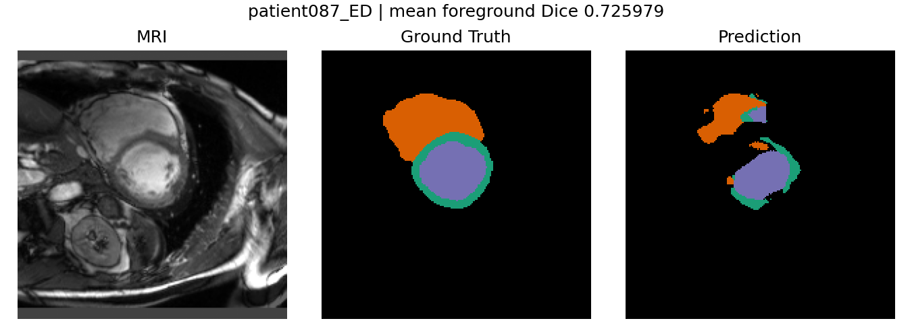
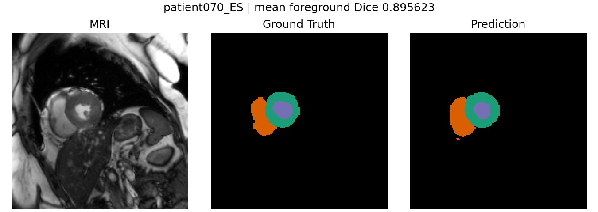
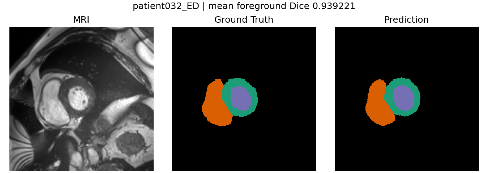

# Cardiac MRI 3D Segmentation

Compact PyTorch project for 3D cardiac MRI segmentation on the ACDC dataset. The
model segments end-diastolic and end-systolic cardiac MRI volumes with
`CompactUNet3D`, using the following label mapping:

| Label | Class |
| --- | --- |
| 0 | background |
| 1 | RV cavity |
| 2 | myocardium |
| 3 | LV cavity |

The project is organized as a production-style research codebase: typed source
modules, YAML-driven experiments, unit and integration tests, final validation
reports, original-geometry NIfTI prediction export, and ONNX deployment
validation.

## Main Capabilities

- ACDC NIfTI dataset loading, indexing, and patient metadata parsing.
- Geometry and label validation for image/mask pairs.
- MRI preprocessing with resampling, center crop/pad, and intensity
  normalization.
- `CompactUNet3D`, a compact anisotropic 3D U-Net for multiclass segmentation.
- Cross-Entropy plus Dice loss for foreground segmentation learning.
- Deterministic patient-level train/validation split.
- Checkpointing, resumable training, `ReduceLROnPlateau`, and early stopping.
- Dice evaluation and HD95 evaluation in millimeters.
- Validation visualizations for ranked worst, middle, and best validation cases.
- Restoration of model-space predictions to original NIfTI geometry.
- ONNX export and PyTorch/ONNX Runtime parity validation.

## Final Model Results

Final validation used the 100 ACDC training patients with an 80/20 patient-level
split: 80 training patients, 20 validation patients, 160 training ED/ES volumes,
and 40 validation ED/ES volumes. The selected final checkpoint is epoch 48.

| Metric | Mean | Median | Min | Max |
| --- | ---: | ---: | ---: | ---: |
| Mean foreground Dice | 0.875813 | 0.891567 | 0.725979 | 0.939221 |

| Class | Mean Dice | Mean HD95 |
| --- | ---: | ---: |
| RV cavity | 0.857680 | 7.170 mm |
| Myocardium | 0.848559 | 3.208 mm |
| LV cavity | 0.921201 | 3.665 mm |
| Mean foreground | 0.875813 | 4.681 mm |

## Training Summary

The final run trained `CompactUNet3D` with `base_channels = 8` on a CUDA GPU.
Optimization used AdamW, an initial learning rate of `0.001`,
`ReduceLROnPlateau`, scheduler factor `0.5`, scheduler patience `8`,
early-stopping patience `20`, and minimum improvement `0.001`. The run was
configured for a maximum of 200 epochs, stopped early at epoch 68, and selected
epoch 48 as the best checkpoint.

The committed `configs/patient_level_training.yaml` is a smaller 10-patient,
20-epoch training configuration for practical reruns. The full validation,
resume, visualization, and ONNX configs target the final project artifacts.

## Validation Visualization

Validation visualization exports representative worst, middle, and best
validation cases. Each figure contains six panels:

`MRI | Ground Truth | Prediction | GT overlay | Prediction overlay | contours`

The committed examples below are documentation copies of the final validation
figures:

| Worst | Middle | Best |
| --- | --- | --- |
|  |  |  |

The slice-review workflow also exports multiple slices per selected case, with a
JSON manifest recording the chosen case IDs and slice indices.

## Original NIfTI Export

Validation inference can restore each model-space prediction back to the
original MRI grid. The exporter undoes center crop/pad, resamples discrete label
predictions with nearest-neighbor interpolation, and saves NIfTI outputs with
the original shape, affine, voxel spacing, and orientation metadata.

## ONNX Deployment

The final checkpoint can be exported to ONNX as a raw-logit model. The verified
contract is:

- Input: `image`, `float32`, shape `[1, 1, 24, 192, 192]`
- Output: `logits`, `float32`, shape `[1, 4, 24, 192, 192]`
- ONNX opset: 18
- ONNX model size: about 1.42 MB
- PyTorch/ONNX parity: passed
- Max absolute difference: `0.0022666454`
- Mean absolute difference: `0.0001460407`

See [docs/onnx_deployment_contract.md](docs/onnx_deployment_contract.md) for
the deployment contract.

## Repository Structure

```text
.
|-- configs/                     # YAML experiment and data configs
|-- docs/                        # Project documentation
|-- scripts/                     # Runnable experiment/export entry points
|-- src/cardiac_segmentation/
|   |-- data/                    # ACDC indexing, inspection, dataset loading
|   |-- preprocessing/           # NIfTI loading, resampling, crop/pad, intensity prep
|   |-- models/                  # CompactUNet3D architecture
|   |-- losses/                  # Cross-Entropy + Dice loss
|   |-- metrics/                 # Dice and HD95 metrics
|   |-- training/                # Training, checkpointing, resume, early stopping
|   |-- evaluation/              # Validation inference, visualization, NIfTI export
|   `-- deployment/              # ONNX export and parity validation
|-- tests/                       # Unit and integration tests
|-- pyproject.toml               # Package metadata, dependencies, tooling
`-- README.md
```

Large datasets, checkpoints, generated reports, medical images, and exported
models are intentionally gitignored.

## Quick Start

Requires Python `>=3.12,<3.13`.

```bash
python -m venv .venv
source .venv/bin/activate
python -m pip install --upgrade pip
python -m pip install -e ".[dev]"
```

Place the ACDC dataset under `data/raw/acdc/` using the expected ACDC training
patient layout. Then run:

```bash
# Inspect the dataset and write JSON/CSV inspection artifacts.
python scripts/inspect_dataset.py

# Run tests. ACDC-marked integration tests require the real dataset.
python -m pytest

# Start the patient-level training experiment from configs/patient_level_training.yaml.
python scripts/run_patient_level_training.py

# Resume from configs/patient_level_resume_training.yaml.
python scripts/resume_patient_level_training.py

# Run validation inference, metrics, ranked visualizations, and original NIfTI export.
python scripts/run_validation_inference.py

# Export ranked multi-slice validation review figures.
python scripts/run_validation_visualization.py

# Export the final CompactUNet3D checkpoint to ONNX and validate parity.
python scripts/export_onnx_model.py
```

## Limitations

- This is an ACDC-only research/portfolio prototype.
- The reported validation set is a patient-level split from the 100-patient ACDC
  training cohort, not an independent external clinical test cohort.
- The project uses a fixed `CompactUNet3D` architecture.
- The ONNX deployment contract currently uses the fixed input shape
  `[1, 1, 24, 192, 192]`.
- The model has not undergone clinical validation and is not a medical device.
- Production PACS/DICOM integration is not implemented.
- Integration with the planned Qt AI workstation is future work and is not
  implemented in this repository.

## Dataset

This project uses the ACDC cardiac MRI dataset. The repository contains dataset
loading and preprocessing code, but it does not include the ACDC data itself or
a complete bibliographic citation for the dataset.

## Notes

This repository does not include the ACDC dataset, checkpoints, generated CSV
reports, original-space prediction NIfTI files, or exported ONNX artifacts.
Those files are generated locally under `data/` and `artifacts/`.
